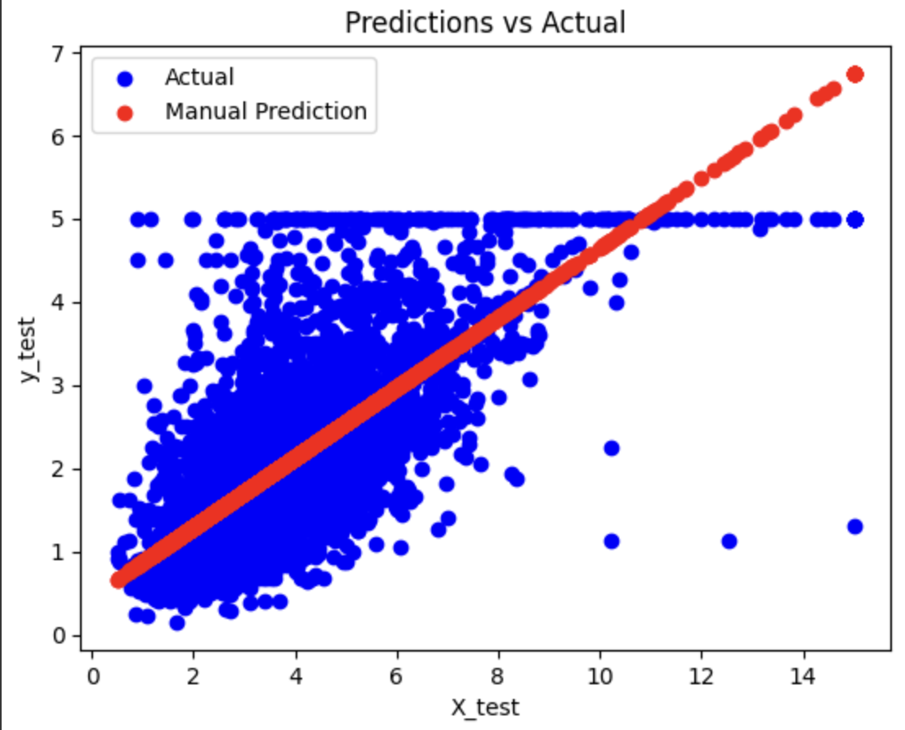

# 01: Linear Regression - California Housing Price Prediction

This project uses the California Housing dataset to explore linear regression techniques for predicting housing prices.

## 📈 Predictions vs Actual
Here’s the model’s predictions compared to actual housing prices:

## 📊 Dataset
- Source: `sklearn.datasets.fetch_california_housing()`
- Features include:
  - Median Income (`MedInc`)
  - Average Rooms (`AveRooms`)
  - House Age
  - ... and more.

## 🛠️ Methods
- Data visualization (scatter plots)
- Manual gradient descent implementation:
  - Cost function (MSE)
  - Gradient calculation
  - Weight/bias updates
- scikit-learn `LinearRegression` for comparison
- Model evaluation:
  - R² score
  - Mean Squared Error (MSE)

## 🖼️ Visualizations
- Scatter plots: `MedInc` vs `Price`, `AveRooms` vs `Price`
- Cost function convergence during gradient descent
- Predictions vs actual house prices

## 🔗 Files
- **`california_housing_prediction.ipynb`**: Main notebook with all analysis
- **`README.md`**: Project overview (this file)

## 🚀 Next Steps
- Explore multiple features regression
- Add regularization (L1, L2)
- Try other models (e.g., decision trees)

---

